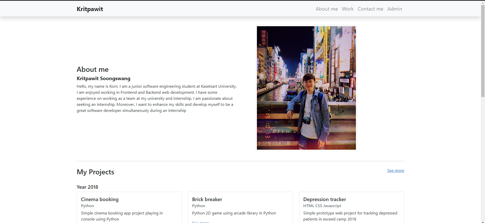

# Portfolio for Software Architecture subject

## Kritpawit Soongswang 6110545414

# Usage

To use this template to start your own project:

### Existing virtualenv

If your project is already in an existing python3 virtualenv first install django by running

    $ pip install django
    
      
### No virtualenv

This assumes that `python3` is linked to valid installation of python 3 and that `pip` is installed and `pip3`is valid
for installing python 3 packages.

Installing inside virtualenv is recommended, however you can start your project without virtualenv too.

If you don't have django installed for python 3 then run:

    $ pip3 install django
    
      
After that just install the local dependencies, run migrations, and start the server.

# Getting Started

Activate the virtualenv for your project.
Then simply apply the migrations:

    $ python manage.py migrate
    

You can now run the development server:

    $ python manage.py runserver